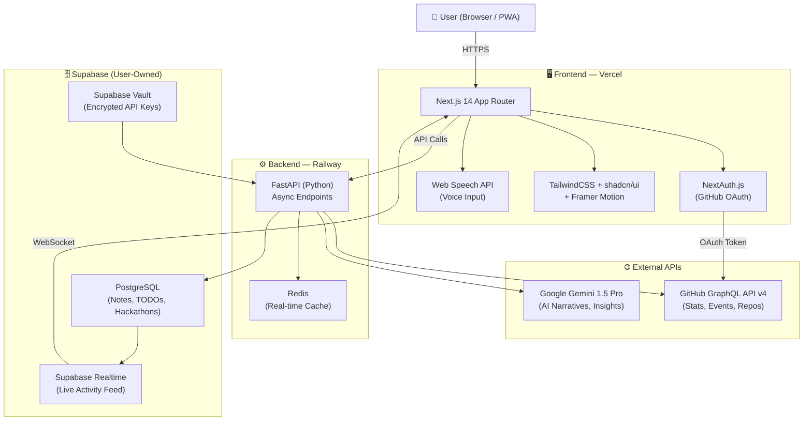

```
██████╗ ███████╗██╗   ██╗███╗   ██╗███████╗██╗  ██╗██╗   ██╗███████╗
██╔══██╗██╔════╝██║   ██║████╗  ██║██╔════╝╚██╗██╔╝██║   ██║██╔════╝
██║  ██║█████╗  ██║   ██║██╔██╗ ██║█████╗   ╚███╔╝ ██║   ██║███████╗
██║  ██║██╔══╝  ╚██╗ ██╔╝██║╚██╗██║██╔══╝   ██╔██╗ ██║   ██║╚════██║
██████╔╝███████╗ ╚████╔╝ ██║ ╚████║███████╗██╔╝ ██╗╚██████╔╝███████║
╚═════╝ ╚══════╝  ╚═══╝  ╚═╝  ╚═══╝╚══════╝╚═╝  ╚═╝ ╚═════╝ ╚══════╝

         🧠 The AI-Powered Creator Command Center
     Your code should work for you, not the other way around.
```

<div align="center">

[](https://github.com/yourusername/devnexus/actions)
[](https://opensource.org/licenses/MIT)
[](https://github.com/yourusername/devnexus/stargazers)
[](https://nextjs.org)
[](https://fastapi.tiangolo.com)
[](https://supabase.com)
[](https://deepmind.google/technologies/gemini/)
[](https://github.com/yourusername/devnexus)
[](https://github.com/yourusername/devnexus/pulls)
[](https://devnexus.vercel.app)

<br/>

**[Live Demo](https://devnexus.vercel.app)** · **[Documentation](https://docs.devnexus.dev)** · **[Report Bug](https://github.com/yourusername/devnexus/issues)** · **[Request Feature](https://github.com/yourusername/devnexus/discussions)**

<br/>

> *"The dashboard your GitHub deserves."*

</div>

---

## ⚡ What is DevNexus?

**DevNexus** is an intelligent, self-evolving command center built for indie developers, student hackers, and open-source creators. It fuses **real-time GitHub telemetry**, **AI-generated progress narratives**, a **voice-activated task engine**, and **hackathon mission control** — all in a single, blazing-fast, beautifully designed web app.

Stop juggling 12 browser tabs. Stop forgetting what you shipped yesterday. Stop walking into a hackathon blind. DevNexus puts your entire developer life on one screen — and then makes it smarter.

---

## 🔥 Why DevNexus?

Every serious developer eventually runs into the same three walls:

- 🧱 **"What did I even do this week?"** — Your work is scattered across commits, issues, Notion pages, and Discord threads. There's no single narrative of your progress.
- 🧱 **"My tasks are everywhere."** — GitHub Issues, a sticky note, a voice memo, a TODO comment buried in a file. Your system is chaos.
- 🧱 **"Hackathons feel like a blur."** — No structured planning, no pitch prep, no deadlines in view. You ship, submit, and forget.

DevNexus was built to demolish all three. One command center. Every context. Zero compromise.

---

## ✨ Features

> DevNexus isn't a feature list. It's a philosophy made functional.

---

### 🧠 1. AI Progress Narrator

Your daily developer story, written by AI so you don't have to.

- **Dev Daily Chronicle** — Every morning at 9 AM, Gemini 1.5 Pro scans your GitHub commits, closed issues, and completed TODOs from the past 24 hours and generates a developer blog-style narrative paragraph summarizing what you actually built.
- **🔥 Roast Mode** — Shipped nothing yesterday? Gemini absolutely will not let that slide. Toggle Roast Mode and receive a scathing, sarcastic paragraph about your "incredible" productivity. Therapeutic. Humbling. Hilarious.
- **Weekly Dev Arc** — Every Sunday, get a short-story-style narrative of your entire week: what you started, what you shipped, what you abandoned (and why that's okay).
- Shareable as a beautifully formatted card — post your Daily Chronicle to Twitter/X in one click.

---

### 📊 2. GitHub Command Center

Your repo ecosystem, at a glance — real-time and ridiculously detailed.

- **Live GitHub Stats** — Contribution streak, total stars, fork counts, PR merge velocity, and language breakdown — all fetched fresh via GitHub GraphQL API v4.
- **Custom Heatmap Calendar** — A fully custom-rendered contribution graph (not GitHub's default) with color intensity, hover details, and streak highlights. Dark-mode first. Gorgeous.
- **Repository Health Score** — Each repo gets a 0–100 health score calculated from README quality, CI/CD configuration presence, test coverage indicators, documentation breadth, and average issue response time.
- **Trending Contribution Targets** — DevNexus surfaces trending open-source repos that match your language stack and stars them for potential contribution, powered by GitHub's trending API.
- **🔮 Commit Forecast** — An AI model analyzes your historical commit patterns (time of day, day of week, sprint cadence) and forecasts your likely commit activity for the next 7 days. Know your own rhythm.

---

### 📝 3. Project Notebook (Markdown + AI)

Your second brain — structured, searchable, and AI-supercharged.

- **Rich Markdown Editor** — Powered by Monaco Editor (the same engine as VS Code) with live split-pane preview, syntax highlighting, and keyboard shortcuts you already know.
- **Repo-Linked Notes** — Every project note auto-links to its GitHub repository. Open a repo card, get its notebook. Context-switch without losing context.
- **🪄 Idea Expander** — Type a one-liner idea ("Build a URL shortener with analytics") and Gemini expands it into a full project specification: problem statement, proposed architecture, tech stack recommendation, MVP scope, and stretch goals. From spark to spec in 10 seconds.
- **Version History + Diff Viewer** — Every save is versioned. Roll back to any point. See exactly what changed between versions with a side-by-side diff view.
- **Smart Auto-Tagging** — AI reads your note content and auto-applies relevant tags (e.g., `#backend`, `#auth`, `#performance`, `#idea`). Find anything instantly.

---

### ✅ 4. Smart TODO Engine

The task manager that thinks before you do.

- **🎙️ Voice-to-TODO** — Tap a mic button, say "Refactor the auth middleware and write tests for the login endpoint," and your TODO list updates instantly using the Web Speech API. Hands-free productivity.
- **AI Priority Engine** — Every TODO is automatically scored on urgency × impact and ranked accordingly. Stop guessing what to work on next. Let the model tell you.
- **Subtask Auto-Generation** — Add a high-level task ("Build the login page") and Gemini generates 5 actionable, technical subtasks automatically. Break down work without breaking your flow.
- **Recurring Tasks + Streak Tracking** — Set daily/weekly recurring tasks and track your consistency with streaks. Miss three days? You get a gentle (or roast-mode) nudge.
- **Kanban + List View** — Drag-and-drop Kanban board (To Do / In Progress / Done) with smooth Framer Motion animations, or a flat list view for minimalists. Switch anytime.
- **⏱️ Focus Mode** — Hides everything except your top 3 priority tasks for the day and overlays a Pomodoro timer with session tracking. The rest of the world disappears.

---

### 🏆 5. Hackathon Mission Control

Because winning a hackathon is a project in itself.

- **Hackathon Registry** — Add any hackathon with name, theme, deadline, team members, tech stack, and prize pool. Everything in one place.
- **Countdown Timers** — Live countdown with urgency-aware color shifts: green (>7 days), yellow (2–7 days), red (<48 hours). You'll never submit at 11:59 PM again. Maybe.
- **Phase Tracker** — Track each hackathon project through four phases: **Ideation → Build → Polish → Submit**, with sub-checklists and progress bars per phase.
- **🎤 AI Pitch Generator** — Input your project idea and tech stack. Gemini writes a full 3-minute pitch script: hook, problem statement, solution, demo narrative, impact statement, and closing. Presentation-ready in seconds.
- **🧑‍⚖️ Judge Simulator** — AI acts as a tough hackathon judge. Submit your project idea and get scored on Innovation (0–25), Execution (0–25), Impact (0–25), and Presentation (0–25) with written feedback. Iterate before the real judges see it.
- **Archive + Outcome Tracking** — Keep a record of every hackathon you've entered: placed, won, submitted, or "learned a lot." Your hacking history, preserved.

---

### 🤖 6. NEXUS AI Assistant

Your always-on, context-aware developer copilot.

- **Persistent Sidebar Chat** — A Gemini-powered chat panel that stays open while you work. Ask anything. Get answers grounded in your actual data.
- **Full Dashboard Context** — NEXUS knows your repos, your TODOs, your notes, your hackathon deadlines, and your commit history. It's not a generic chatbot. It's *your* assistant.
- **Action Commands** — NEXUS doesn't just answer — it acts:
  - `"Add a TODO: Fix the CORS issue on the API"`
  - `"Summarize my week in developer terms"`
  - `"Show me repos with zero commits this month"`
  - `"Create a note for Project Athena"`
  - `"Generate a pitch for my hackathon submission"`
- **⌨️ Command Palette (CMD+K)** — Power-user command palette for instant navigation, task creation, note search, and AI invocation. Keyboard-first, mouse-optional.

---

### 📡 7. Live Activity Feed

Your GitHub universe, streaming in real time.

- **Real-Time Event Stream** — Pushes, pull requests, issue opens and closes, stars, forks — all flowing in via Supabase Realtime + WebSockets. Zero polling.
- **Advanced Filtering** — Filter the feed by repository, event type (push / PR / issue / star), time range, or contributor. Signal over noise.
- **Smart Notifications** — Alert system for high-signal events:
  - ⭐ Someone starred your repo
  - ✅ A PR you opened was merged
  - ⚠️ A hackathon deadline is within 48 hours
  - 🔴 A repo you watch has an unacknowledged critical issue
- Notification center with read/unread state, persistence, and one-click navigation to the relevant resource.

---

### 🎨 8. Theming & Personalization

Because your workspace should feel like *yours*.

- **5 Signature Themes:**
  - 🌙 **Midnight Hacker** — Deep navy, electric indigo, monospace everything.
  - 🌈 **Neon Cyberpunk** — Hot pink, cyan, black. You'll feel like you're hacking in 2077.
  - 🌲 **Forest Dev** — Muted greens and earth tones. Calm focus mode.
  - ❄️ **Arctic White** — Clean, minimal, blinding white. For the productivity purists.
  - ☀️ **Solarized Gold** — The classic Solarized palette. For those who never moved on (compliment).
- **Custom Accent Color Picker** — Override any theme's accent color with a full HSL color picker.
- **Widget-Based Layout** — Every panel is draggable, resizable, hideable. Build the dashboard *you* want.
- **🎵 Vibe Mode** — Embedded lo-fi music player (YouTube/Spotify toggle) that plays a curated lo-fi playlist while you code. Because silence is the enemy of flow.

---

### 📱 9. Mobile PWA

Your command center in your pocket.

- **Installable PWA** — Add to home screen on Android (Chrome) or iOS (Safari). Looks and feels like a native app.
- **Mobile-First Responsive Design** — Every view (dashboard, notebooks, TODOs, hackathons) is fully optimized for touch interfaces and small screens. Not an afterthought. A first-class experience.
- **Offline Mode** — Service workers cache your notes and TODO list locally. Read and edit them without a connection. Sync on reconnect.
- Background sync for TODO completions and note edits made offline.

---

### 🔐 10. Privacy & Data Control

Your data. Your infrastructure. Your rules.

- **Bring Your Own Backend** — All data is stored in *your* Supabase instance. DevNexus never owns your data. We provide the UI; you provide the database.
- **One-Click Export** — Export everything (notes, TODOs, hackathon data, activity logs) as clean JSON or CSV. Always portable. Never locked in.
- **Secure API Key Manager** — Store your Gemini API key, GitHub Personal Access Token, and other credentials encrypted in your own Supabase Vault. No keys stored on DevNexus servers.
- GDPR-friendly architecture by design.

---

## 🏗️ Architecture



---

## 🚀 Quick Start

Get DevNexus running locally in under 5 minutes.

### Prerequisites

Make sure you have the following installed:

```bash
node -v    # v18.17+ required
python -v  # v3.11+ required
git --version
```

You'll also need accounts on:
- [GitHub](https://github.com) (for OAuth + API access)
- [Supabase](https://supabase.com) (free tier is fine)
- [Google AI Studio](https://aistudio.google.com) (for Gemini API key)
- [Railway](https://railway.app) (for backend deployment, optional for local dev)

---

### 1. Clone the Repository

```bash
git clone https://github.com/yourusername/devnexus.git
cd devnexus
```

### 2. Install Frontend Dependencies

```bash
cd apps/web
npm install
```

### 3. Install Backend Dependencies

```bash
cd ../../apps/api
python -m venv venv
source venv/bin/activate        # On Windows: venv\Scripts\activate
pip install -r requirements.txt
```

### 4. Configure Environment Variables

```bash
# Copy example env files
cp apps/web/.env.example apps/web/.env.local
cp apps/api/.env.example apps/api/.env
```

Fill in your credentials (see [Environment Variables](#-environment-variables) below).

### 5. Set Up Supabase

```bash
# Run the Supabase migrations
npx supabase db push --db-url "postgresql://your-supabase-url"

# Or use the Supabase Studio UI with the SQL files in:
# packages/database/migrations/
```

### 6. Run the Development Servers

Open two terminal windows:

**Terminal 1 — Frontend:**
```bash
cd apps/web
npm run dev
# → http://localhost:3000
```

**Terminal 2 — Backend:**
```bash
cd apps/api
source venv/bin/activate
uvicorn main:app --reload --port 8000
# → http://localhost:8000
# → API Docs: http://localhost:8000/docs
```

### 7. Open DevNexus

Navigate to [http://localhost:3000](http://localhost:3000), sign in with GitHub, and your command center is live. 🎉

---

## 🔧 Environment Variables

### Frontend (`apps/web/.env.local`)

| Variable | Required | Description |
|---|---|---|
| `NEXTAUTH_URL` | ✅ | Your app URL (e.g., `http://localhost:3000`) |
| `NEXTAUTH_SECRET` | ✅ | Random secret string (use `openssl rand -base64 32`) |
| `GITHUB_CLIENT_ID` | ✅ | GitHub OAuth App Client ID |
| `GITHUB_CLIENT_SECRET` | ✅ | GitHub OAuth App Client Secret |
| `NEXT_PUBLIC_SUPABASE_URL` | ✅ | Your Supabase project URL |
| `NEXT_PUBLIC_SUPABASE_ANON_KEY` | ✅ | Supabase anonymous/public key |
| `NEXT_PUBLIC_API_URL` | ✅ | Backend FastAPI URL (e.g., `http://localhost:8000`) |
| `NEXT_PUBLIC_APP_URL` | ✅ | Frontend base URL for internal links |

### Backend (`apps/api/.env`)

| Variable | Required | Description |
|---|---|---|
| `SUPABASE_URL` | ✅ | Your Supabase project URL |
| `SUPABASE_SERVICE_KEY` | ✅ | Supabase service role key (keep secret!) |
| `GEMINI_API_KEY` | ✅ | Google Gemini API key from AI Studio |
| `GITHUB_APP_TOKEN` | ✅ | GitHub Personal Access Token (scopes: `repo`, `read:user`) |
| `REDIS_URL` | ✅ | Redis connection string (e.g., `redis://localhost:6379`) |
| `SECRET_KEY` | ✅ | FastAPI JWT signing secret |
| `ENVIRONMENT` | ✅ | `development` or `production` |
| `CORS_ORIGINS` | ✅ | Comma-separated allowed origins (e.g., `http://localhost:3000`) |

> 💡 **Tip:** Never commit `.env` files. They're in `.gitignore` by default. Use [Doppler](https://doppler.com) or [Vercel Environment Variables](https://vercel.com/docs/projects/environment-variables) for production secret management.

---

## 📁 Project Structure

```
devnexus/
├── 📁 apps/
│   ├── 📁 web/                          # Next.js 14 frontend
│   │   ├── 📁 app/                      # App Router pages & layouts
│   │   │   ├── 📁 (auth)/               # Auth routes (login, callback)
│   │   │   ├── 📁 (dashboard)/          # Protected dashboard routes
│   │   │   │   ├── 📁 github/           # GitHub Command Center page
│   │   │   │   ├── 📁 notebook/         # Project Notebook page
│   │   │   │   ├── 📁 todos/            # Smart TODO Engine page
│   │   │   │   ├── 📁 hackathons/       # Hackathon Mission Control page
│   │   │   │   └── 📁 activity/         # Live Activity Feed page
│   │   │   ├── layout.tsx               # Root layout with providers
│   │   │   └── page.tsx                 # Landing page
│   │   ├── 📁 components/
│   │   │   ├── 📁 ui/                   # shadcn/ui base components
│   │   │   ├── 📁 dashboard/            # Dashboard layout components
│   │   │   ├── 📁 github/               # GitHub stats, heatmap, health score
│   │   │   ├── 📁 notebook/             # Markdown editor, note cards
│   │   │   ├── 📁 todos/                # Kanban, list, focus mode
│   │   │   ├── 📁 hackathons/           # Hackathon cards, phase tracker
│   │   │   ├── 📁 nexus/                # NEXUS AI sidebar chat
│   │   │   ├── 📁 activity/             # Activity feed, notification bell
│   │   │   └── 📁 shared/              # Buttons, modals, tooltips, etc.
│   │   ├── 📁 hooks/                    # Custom React hooks
│   │   │   ├── useGitHub.ts             # GitHub data fetching hook
│   │   │   ├── useSpeech.ts             # Web Speech API hook
│   │   │   ├── useSupabaseRealtime.ts   # Realtime subscription hook
│   │   │   └── useNexusChat.ts          # NEXUS AI chat state hook
│   │   ├── 📁 lib/
│   │   │   ├── supabase.ts              # Supabase client
│   │   │   ├── github.ts                # GitHub API helpers
│   │   │   ├── gemini.ts                # Gemini client wrapper
│   │   │   └── utils.ts                 # cn(), date helpers, etc.
│   │   ├── 📁 stores/                   # Zustand global state stores
│   │   │   ├── useThemeStore.ts
│   │   │   ├── useTodoStore.ts
│   │   │   └── useHackathonStore.ts
│   │   ├── 📁 types/                    # TypeScript interfaces & types
│   │   ├── 📁 styles/                   # Global CSS, theme tokens
│   │   ├── 📁 public/                   # Static assets, PWA manifest
│   │   │   ├── manifest.json            # PWA manifest
│   │   │   └── sw.js                    # Service worker (offline mode)
│   │   ├── next.config.js
│   │   ├── tailwind.config.ts
│   │   └── tsconfig.json
│   │
│   └── 📁 api/                          # FastAPI Python backend
│       ├── 📁 routers/
│       │   ├── github.py                # GitHub data endpoints
│       │   ├── ai.py                    # Gemini AI endpoints
│       │   ├── todos.py                 # TODO CRUD + AI ranking
│       │   ├── notes.py                 # Notebook CRUD + versioning
│       │   └── hackathons.py            # Hackathon management endpoints
│       ├── 📁 services/
│       │   ├── github_service.py        # GitHub GraphQL API logic
│       │   ├── gemini_service.py        # Gemini API integration
│       │   ├── narrator_service.py      # Daily Chronicle + Dev Arc logic
│       │   └── scheduler.py            # APScheduler for 9AM daily runs
│       ├── 📁 models/                   # SQLAlchemy / Pydantic models
│       ├── 📁 middleware/               # Auth middleware, rate limiting
│       ├── main.py                      # FastAPI app entrypoint
│       ├── requirements.txt
│       └── Dockerfile
│
├── 📁 packages/
│   ├── 📁 database/                     # Supabase schema & migrations
│   │   ├── 📁 migrations/               # SQL migration files
│   │   └── schema.sql                   # Full database schema
│   ├── 📁 shared-types/                 # Types shared between web & api
│   └── 📁 config/                       # Shared ESLint, Prettier, TS configs
│
├── 📁 .github/
│   ├── 📁 workflows/
│   │   ├── ci.yml                       # CI: lint, test, type-check
│   │   └── deploy.yml                   # CD: Vercel + Railway deploy
│   └── 📁 ISSUE_TEMPLATE/
│       ├── bug_report.md
│       └── feature_request.md
│
├── docker-compose.yml                   # Local full-stack dev environment
├── turbo.json                           # Turborepo build pipeline config
├── package.json                         # Root workspace package.json
└── README.md                            # You are here 👋
```

---

## 🤝 Contributing

We love contributions. DevNexus is better because of the community that builds it.

### Getting Started

1. **Fork** the repository on GitHub.
2. **Clone** your fork locally:
   ```bash
   git clone https://github.com/YOUR_USERNAME/devnexus.git
   ```
3. **Create a feature branch** using our naming convention:
   ```bash
   git checkout -b feat/add-dark-mode-toggle
   # OR
   git checkout -b fix/github-heatmap-overflow
   # OR
   git checkout -b docs/update-env-variable-table
   ```
   **Branch naming prefixes:** `feat/` · `fix/` · `docs/` · `refactor/` · `test/` · `chore/`

4. **Make your changes**, writing clean, typed, commented code.
5. **Run the test suite** before pushing:
   ```bash
   # Frontend
   cd apps/web && npm run test && npm run type-check && npm run lint

   # Backend
   cd apps/api && pytest && ruff check .
   ```
6. **Commit** using [Conventional Commits](https://www.conventionalcommits.org/):
   ```bash
   git commit -m "feat(todos): add voice-to-todo microphone trigger"
   git commit -m "fix(github): handle rate limit on heatmap fetch"
   git commit -m "docs(readme): add Railway deployment instructions"
   ```
7. **Push** to your fork and **open a Pull Request** against `main`.

### Pull Request Checklist

Before submitting your PR, make sure you can check every box:

- [ ] My code follows the existing code style and patterns
- [ ] I've added or updated TypeScript types where needed
- [ ] All existing tests pass (`npm run test`)
- [ ] I've added tests for any new functionality
- [ ] I've run the linter (`npm run lint`) with no errors
- [ ] I've updated relevant documentation (README, JSDoc comments, etc.)
- [ ] My PR description clearly explains the change and links the related issue
- [ ] I've tested my changes locally in both light and dark theme
- [ ] I've tested responsive behavior on mobile viewport (375px)
- [ ] No sensitive data (API keys, credentials) is included in the diff

### Development Guidelines

- **TypeScript** is non-negotiable. No `any` types without a documented comment explaining why.
- **Components** should be small, single-responsibility, and composable.
- **API endpoints** must include Pydantic validation and proper HTTP error codes.
- **Gemini prompts** live in `apps/api/services/gemini_service.py` — keep them versioned and commented.
- **Database changes** require a migration file in `packages/database/migrations/`.

### Community

- 💬 **Questions & Discussion:** [GitHub Discussions](https://github.com/yourusername/devnexus/discussions)
- 🐛 **Bug Reports:** [GitHub Issues](https://github.com/yourusername/devnexus/issues)
- 📣 **Announcements:** Watch the repo for releases

---

## 🗺️ Roadmap

DevNexus is alive and shipping. Here's where we're headed.

### ✅ v1.0 — Foundation (Current)
- [x] GitHub OAuth + Command Center
- [x] AI Progress Narrator (Daily Chronicle + Roast Mode)
- [x] Smart TODO Engine with Voice Input
- [x] Project Notebook with Markdown + AI
- [x] Hackathon Mission Control
- [x] NEXUS AI Sidebar Chat
- [x] Live Activity Feed
- [x] 5 Themes + Widget Layout
- [x] Mobile PWA with Offline Mode
- [x] Bring-Your-Own-Backend (Supabase)

### 🔨 v1.5 — Power User Update (Q3 2025)
- [ ] **GitLab & Bitbucket** integration (not just GitHub)
- [ ] **Team Mode** — share a DevNexus workspace with your hackathon team
- [ ] **GitHub PR Review Assistant** — AI summarizes open PRs and suggests reviewer feedback
- [ ] **Streak Protection Alerts** — push notifications when your commit streak is about to break
- [ ] **Custom Gemini Prompt Editor** — let users customize how the AI narrates their work
- [ ] **Export to Notion / Obsidian** — sync notes to external tools
- [ ] **Keyboard Shortcut Map** — full keyboard navigation reference overlay

### 🚀 v2.0 — Ecosystem Expansion (Q1 2026)
- [ ] **DevNexus CLI** — `npx devnexus log "fixed auth bug"` to add TODOs and notes from your terminal without leaving VS Code
- [ ] **VS Code Extension** — DevNexus sidebar panel inside your editor. See your TODOs, run AI actions, and track streaks without switching apps
- [ ] **Discord Bot** — `/devnexus daily` in your server to post the AI Daily Chronicle. `/devnexus pitch` to generate a hackathon pitch in Discord
- [ ] **GitHub App** — Install DevNexus directly as a GitHub App for automatic webhook-based event tracking (no polling, no PAT)
- [ ] **AI Code Review** — NEXUS reviews your last commit diff and gives structured improvement feedback
- [ ] **Multi-AI Support** — Swap Gemini for OpenAI GPT-4o, Claude 3.5, or a local Ollama model
- [ ] **DevNexus Analytics** — Aggregated (anonymized) productivity insights across the community: "Developers who use Focus Mode ship 2.3x more on Fridays"
- [ ] **Sponsors & Open Collective** — Sustainable open-source funding model

---

## 🏆 Hackathon Submission

> *This section is for the judges. We'll keep it honest.*

DevNexus was built in [X hours] at [Hackathon Name]. Here's why it deserves to win.

### 🧩 Innovation

DevNexus isn't a wrapper around GitHub's API — it's a narrative layer on top of it. The AI Progress Narrator is a category-defining feature: no other developer tool generates *story-form* summaries of your work. Roast Mode is genuinely novel UX. The Judge Simulator creates a feedback loop that didn't exist before. These aren't incremental improvements — they're new behaviors.

### 💥 Impact

The target user — indie developers, student hackers, open-source contributors — is massive and chronically underserved by tooling. Jira is for enterprise teams. Linear is beautiful but expensive. GitHub Projects is functional but dumb. DevNexus is the first tool designed from the ground up for the *solo creator* who wants intelligence, not overhead. The PWA and offline support mean it works for developers in low-connectivity environments too.

### ⚙️ Technical Execution

- **Monorepo architecture** (Turborepo) demonstrates production-grade project structure
- **Full-stack TypeScript** with end-to-end type safety via shared packages
- **Async FastAPI** backend with Redis caching handles real-time GitHub data at scale
- **Supabase Realtime** websocket integration for zero-latency activity feeds
- **Gemini 1.5 Pro** with carefully engineered, versioned prompts — not off-the-shelf chatbot wrappers
- **Service workers + IndexedDB** for genuine offline capability (not just "offline-capable" in the PR description)
- **Custom Mermaid + Recharts visualizations** — nothing ripped from GitHub's default UI

### 🎨 Presentation & Design

Five handcrafted themes. Framer Motion animations throughout. A custom heatmap calendar rendered from scratch. A widget-based layout engine. This is not a hackathon project with "good enough" UI. This is a product.

### 🌍 Open Source & Long-Term Vision

DevNexus ships MIT-licensed and free. The v2.0 roadmap (CLI, VS Code extension, Discord bot) shows a genuine product vision, not a hackathon one-and-done. The bring-your-own-backend model means users own their data forever, regardless of what happens to DevNexus as a service.

**We didn't build a demo. We built the beginning of something.**

---

## 📄 License

```
MIT License

Copyright (c) 2025 DevNexus Contributors

Permission is hereby granted, free of charge, to any person obtaining a copy
of this software and associated documentation files (the "Software"), to deal
in the Software without restriction, including without limitation the rights
to use, copy, modify, merge, publish, distribute, sublicense, and/or sell
copies of the Software, and to permit persons to whom the Software is
furnished to do so, subject to the following conditions:

The above copyright notice and this permission notice shall be included in all
copies or substantial portions of the Software.

THE SOFTWARE IS PROVIDED "AS IS", WITHOUT WARRANTY OF ANY KIND, EXPRESS OR
IMPLIED, INCLUDING BUT NOT LIMITED TO THE WARRANTIES OF MERCHANTABILITY,
FITNESS FOR A PARTICULAR PURPOSE AND NONINFRINGEMENT. IN NO EVENT SHALL THE
AUTHORS OR COPYRIGHT HOLDERS BE LIABLE FOR ANY CLAIM, DAMAGES OR OTHER
LIABILITY, WHETHER IN AN ACTION OF CONTRACT, TORT OR OTHERWISE, ARISING FROM,
OUT OF OR IN CONNECTION WITH THE SOFTWARE OR THE USE OR OTHER DEALINGS IN THE
SOFTWARE.
```

See [LICENSE](./LICENSE) for full text.

---

## 👤 Author

<div align="center">

**Built with ☕ caffeine, 🎵 lo-fi beats, and [Cursor](https://cursor.sh)**

*"The best developer tools are the ones that disappear — and let you focus on building."*

---

Made with ❤️ in India 🇮🇳

If DevNexus made your developer life even 1% better, consider:

[](https://github.com/vincenzo-afk/devnexus)
[](https://twitter.com/intent/tweet?text=Just%20discovered%20DevNexus%20—%20an%20AI-powered%20command%20center%20for%20developers.%20This%20thing%20is%20wild.%20%F0%9F%A4%AF%0Ahttps%3A%2F%2Fgithub.com%2Fvincenzo-afk%2Fdevnexus)

</div>

---

<div align="center">
  <sub>
    DevNexus — because every developer deserves a command center as powerful as what they build.
  </sub>
</div>